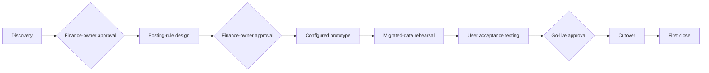

# Technical Approach and Methodology (synthetic sample)

This is a fictional sample built for M10-13-T02 evidence. It is not a client deliverable.

## Solution context

The proposed system sits inside the client organisation and exchanges data with three external services.

<!-- diagram-ir: FIG-001 -->

## Delivery workflow

Delivery follows the ERP sequence in the methodology skill: each phase closes with a finance-owner approval gate before the next begins.

Figure numbering, captions and alt text are applied at build time.
