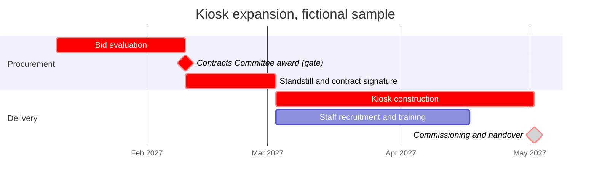

# Implementation Timeline (synthetic sample)

Fictional sample built for M10-13-T06 evidence. Dates and lead times are illustrative assumptions of this sample, not PPDA statutory periods; verify every lead time against the current PPDA instrument before use.

